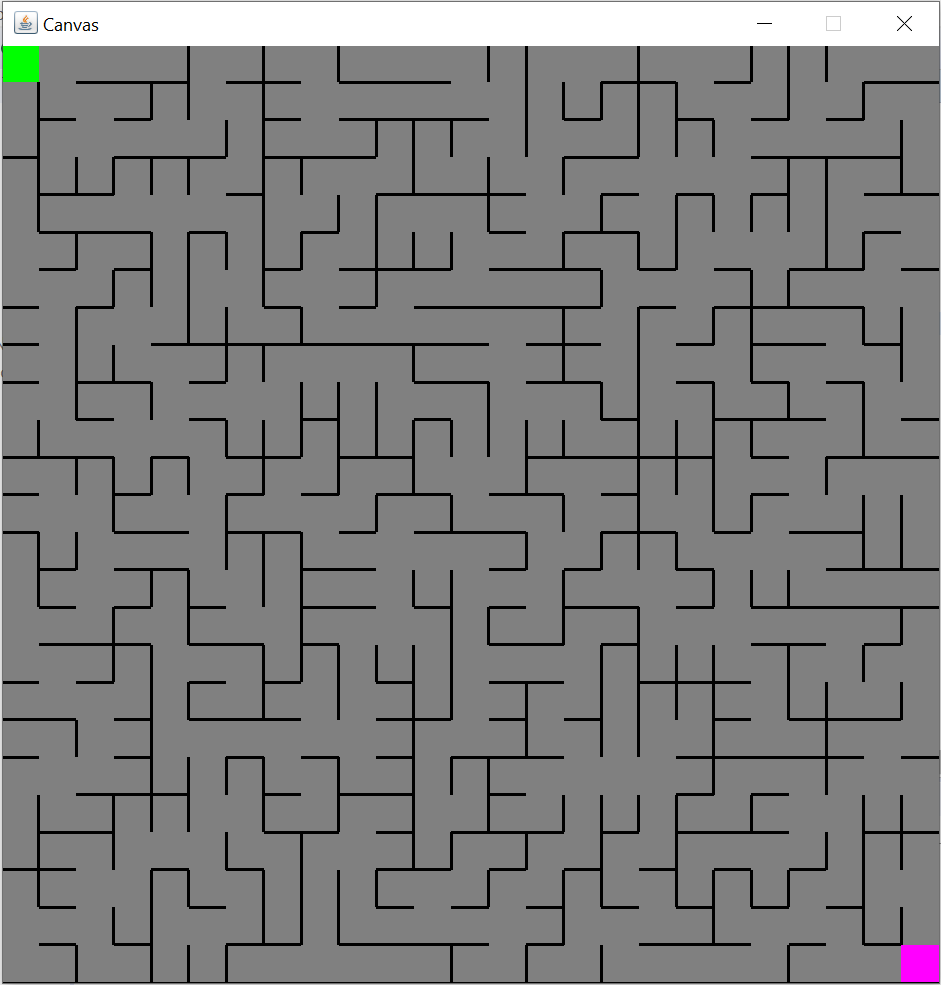
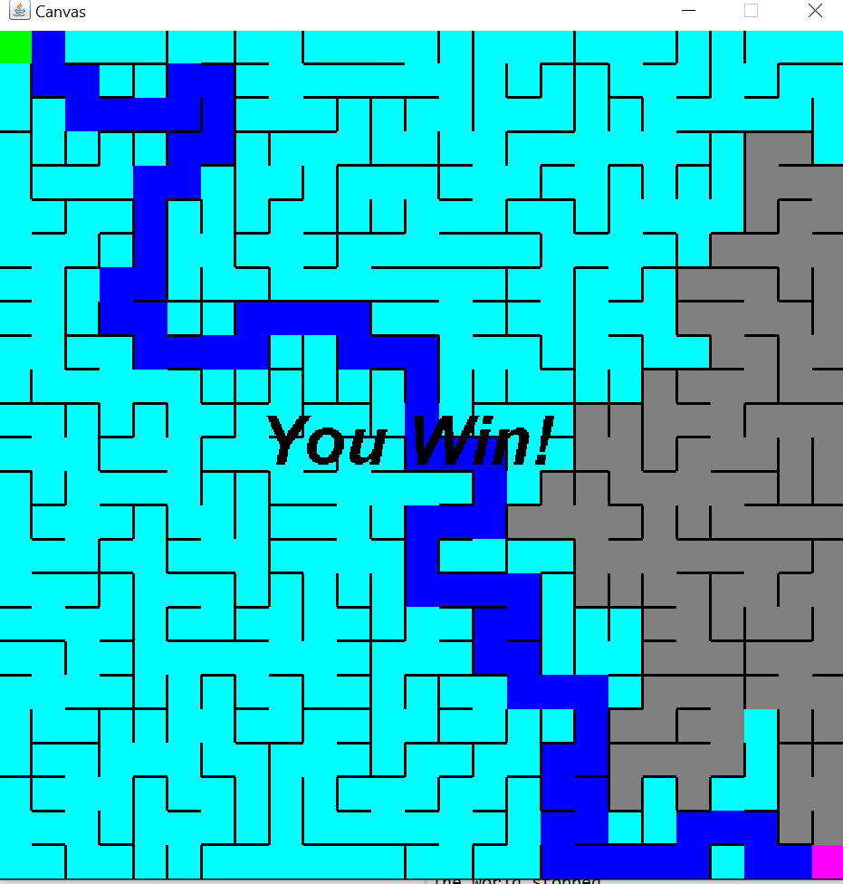
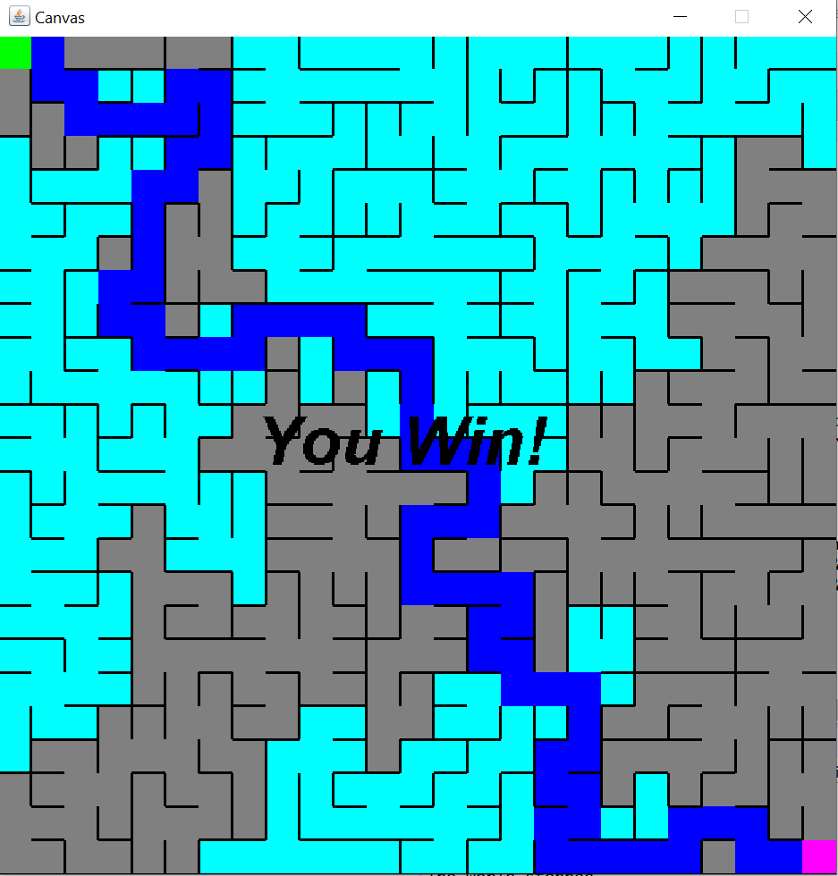

# MazeGame

## Description
This is a maze game where players try to escape by moving from the top-left of the maze to the bottom-right. 
Each maze is randomly generated and has the option to solve itself if the player cannot solve it.

## Directions
Use arrow keys to move the player around to finish the maze.

Press b to solve the maze using breadth first search

Press d to solve the maze using depth first search

Press v to toggle visited vertices being seen

Press r to reset the maze (only works if you have yet to solve the maze)

Can change the sizes of the maze by changing the height and width (and scale when necessary) under class MazeItWorld

    
  

*Example 25x25 Maze*

    
  

*Example 25x25 Maze solved using Breadth First Search*

    
  

*Example 25x25 Maze solved using Depth First Search*

## How to Run the Game

1. Download Eclipse: https://www.eclipse.org/ide/
2. Pull this repository and set EclipseWorkspace as the workspace, or import Mazes into the workspace
3. Import the two external .jar files called tester and javalib (in the repository) into the build path
4. In the run configurations, set the main class as tester.Main and the program arguments as ExamplesMaze
5. Run the program
